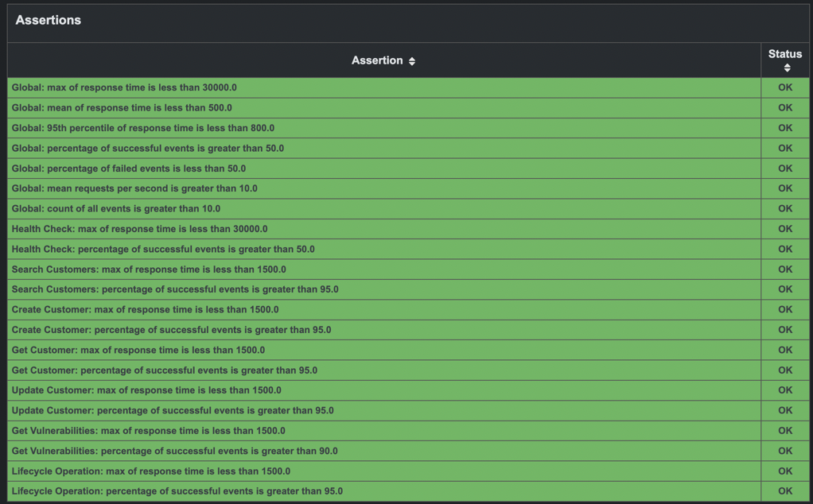
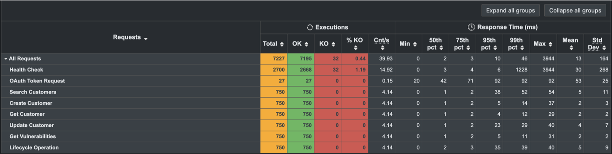
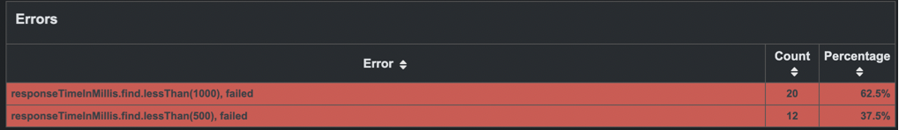
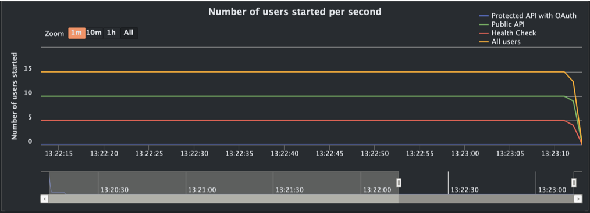
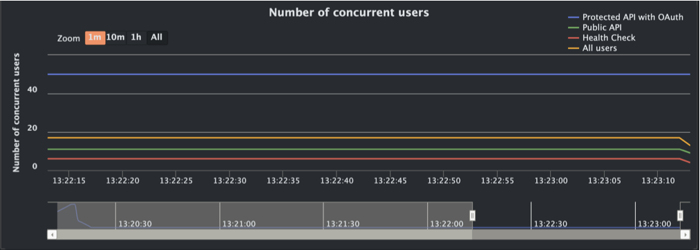
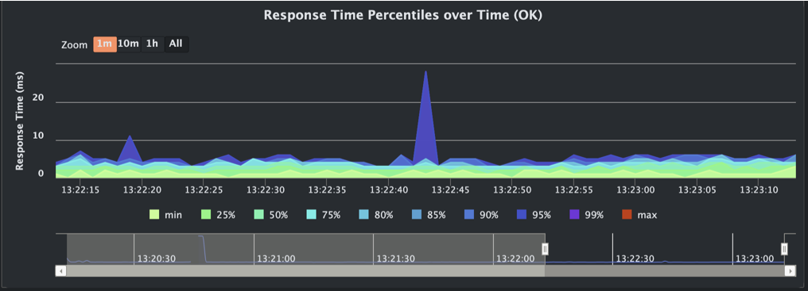
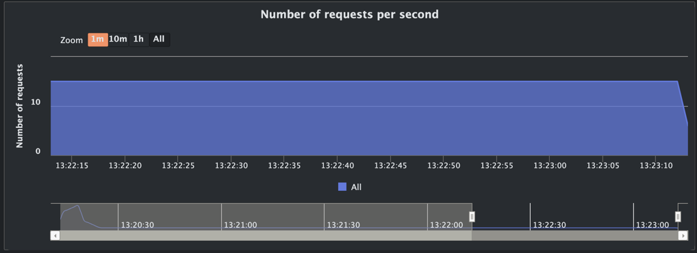
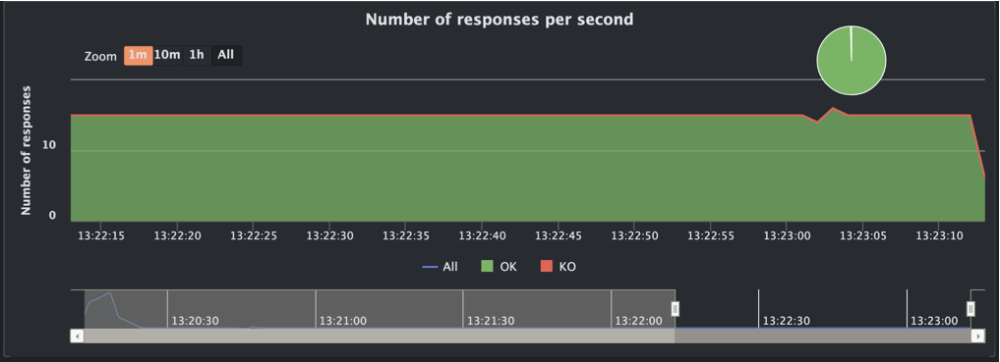

# Kyber
### API Performance Testing Suite


> **About the Name**: Kyber crystals power the lightsabers in Star Wars - they're the core energy source that makes the weapon effective. Similarly, Kyber is the core performance testing framework that powers your API reliability and scalability efforts.

## 📑 Table of Contents
- [🎯 Overview](#-overview)
- [🏗️ Architecture](#️-architecture)
- [⚡ Fast Reset Strategy (AWS-first)](#-fast-reset-strategy-aws-first)
- [🚀 Gatling Quick Start](#-gatling-quick-start-using-the-included-api-stub)
- [📊 Test Scenarios](#-test-scenarios)
- [⚙️ Configuration](#️-configuration)
- [🎛️ Advanced Usage](#️-advanced-usage)
- [🧪 Testing Scripts](#-testing-scripts)
- [🎯 Example Test Commands](#-example-test-commands)
- [📈 Performance Monitoring](#-performance-monitoring)
- [🔧 Configuration File](#-configuration-file)
- [🏗️ Implementation Details](#️-implementation-details)
- [🐛 Troubleshooting](#-troubleshooting)
- [🤝 Contributing](#-contributing)
- [📝 License](#-license)
- [🔗 Related Documentation](#-related-documentation)

## 🎯 Overview

**Kyber** is a comprehensive performance testing suite demonstrating enterprise-grade load testing with **Gatling**, **OAuth 2.0 authentication**, and modern API testing patterns. This project serves as a complete reference implementation for:

- **High-Performance Load Testing** with Gatling Java DSL
- **OAuth 2.0 Client Credentials** flow implementation  
- **Configurable Performance Testing** with externalized properties
- **RESTful API Testing** patterns and best practices
- **Enterprise NFR Validation** with comprehensive assertions
- **AWS-First Reset Strategy** with snapshot-based environment resets for large datasets
- **CI/CD Integration** ready configurations

> **🚀 New to the project?** Check out our [Team Quick Start Guide](docs/TEAM_QUICK_START.md) for a streamlined introduction to testing business-critical APIs with this suite.

## 🏗️ Architecture

```
kyber/
├── api/                                              # Python Flask test server
│   ├── app.py                                        # A fictional API mock server
│   ├── requirements.txt                              # Python dependencies
│   └── run-api.sh                                    # API server startup script
├── assets/                                           # Project assets
│   └── kyber.jpeg                                    # Project logo/banner image
├── docs/                                             # Project documentation
│   ├── FAST_DB_RESET_SNAPSHOT.md                     # AWS snapshot reset documentation
│   └── TEAM_QUICK_START.md                           # Team onboarding guide
├── gatling-maven/                                    # Gatling performance tests
│   ├── pom.xml                                       # Maven project configuration
│   ├── src/test/java/co/tyrell/gatling/              # Java test implementations
│   │   ├── auth/                                     # OAuth 2.0 authentication classes
│   │   │   ├── OAuthConfig.java                      # OAuth configuration
│   │   │   └── OAuthTokenManager.java                # Token management
│   │   └── simulation/                               # Performance test scenarios
│   │       ├── ApiBenchmarkSimulation.java           # Basic performance tests
│   │       └── ApiBenchmarkSimulationWithOAuth.java  # OAuth-enabled tests
│   └── src/test/resources/                           # Configuration files
│       ├── gatling-simulation.properties             # Test configuration parameters
│       ├── gatling.conf                              # Gatling framework settings
│       └── logback-test.xml                          # Logging configuration
├── scripts/                                          # Test automation scripts
│   ├── aws-reset-db.sh                               # AWS database reset script
│   ├── oauth-demo.sh                                 # OAuth demonstration script
│   ├── run-gatling-with-aws-reset.sh                 # Gatling with AWS reset
│   ├── run-oauth-test.sh                             # OAuth-enabled test runner
│   ├── run-standard-test.sh                          # Standard test runner
│   ├── run-with-java21.sh                            # Java 21 specific test runner
│   └── test-oauth-api.sh                             # API validation script
├── .gitignore                                        # Git ignore patterns
├── LICENSE                                           # Project license
└── README.md                                         # This documentation
```

## ⚡ Fast Reset Strategy (AWS-first)

The suite supports pre-test environment resets using storage-level snapshots for near O(1) resets with large datasets. This approach is particularly valuable for performance testing scenarios where you need to reset large databases or persistent volumes quickly between test runs.

> 📚 **Detailed Documentation**: For comprehensive implementation details, configuration options, and step-by-step setup instructions, see [Fast DB Reset via AWS Snapshots](docs/FAST_DB_RESET_SNAPSHOT.md).

**High-level workflow:**

```mermaid
flowchart TD
    A[🗄️ Golden Source Data<br/>Baseline snapshots, cluster ARNs] --> B[⚙️ aws-reset-db.sh<br/>--method aurora|rds|ebs|eks]
    B --> C[🚀 Fresh Environment Ready<br/>Endpoints/volumes ready<br/>JSON output]
    C --> D[🎯 Orchestrator<br/>run-gatling-with-aws-reset.sh<br/>Export endpoint as RESET_DB_ENDPOINT]
    D --> E[📈 Gatling Execution<br/>Performance testing against<br/>cloned data]
    E --> F[🧹 Automatic Cleanup<br/>Remove temporary resources<br/>Cost optimization]
    
    %% Styling
    classDef processBox fill:#e1f5fe,stroke:#01579b,stroke-width:2px
    classDef dataBox fill:#f3e5f5,stroke:#4a148c,stroke-width:2px
    classDef testBox fill:#e8f5e8,stroke:#1b5e20,stroke-width:2px
    classDef cleanupBox fill:#fff3e0,stroke:#e65100,stroke-width:2px
    
    class A dataBox
    class B,C,D processBox
    class E testBox
    class F cleanupBox
```

## 🚀 Gatling Quick Start (using the included API Stub)

### 1. Prerequisites
- **Java 21 LTS** (recommended) or Java 11+
- **Maven 3.6+** 
- **Python 3.x** (for test API server)
- **curl** (for API validation)

### 2. Start the Test API Server
```bash
# Navigate to API directory
cd api

# Install Python dependencies
pip install -r requirements.txt

# Start the fictional Customer API server
python app.py
```

The server will start on `http://localhost:5050` with endpoints:
- `GET /api/health` - Health check
- `POST /oauth/token` - OAuth token generation
- `GET /v3/brands/{brand}/customers` - Search customers
- `POST /v3/brands/{brand}/customers` - Create customer
- And more...

### 3. Run Performance Tests

#### Basic Performance Test
```bash
cd gatling-maven

# Run basic simulation (no OAuth)
mvn gatling:test -Dgatling.simulationClass=co.tyrell.gatling.simulation.ApiBenchmarkSimulation
```

#### OAuth-Enabled Performance Test
```bash
# Run comprehensive OAuth simulation
mvn gatling:test -Dgatling.simulationClass=co.tyrell.gatling.simulation.ApiBenchmarkSimulationWithOAuth
```

### 4. View Results
After running tests, open the generated HTML report:
```
gatling-maven/target/gatling/[simulation-timestamp]/index.html
```

#### Sample Gatling Report Views

The Gatling reports provide comprehensive performance analytics with interactive charts and detailed metrics. Here's what you can expect to see:

**✅ Test Assertions Summary Dashboard**


**� Response Time Distribution**


**⚠️ Error Analysis Dashboard**


**👥 Number of Active Users Over Time**


**� Number of Concurrent Users**


**🎯 Response Time Percentiles**


**� Requests Per Second Throughput**


**📉 Responses Per Second Analysis**


> 💡 **Tip**: These reports are fully interactive - click on any chart element to drill down into specific time ranges or request types. Use the navigation tabs to explore different aspects of your performance test results.

## 📊 Test Scenarios

### 1. ApiBenchmarkSimulation
**Basic performance testing with OAuth token acquisition**
- Health check validation
- OAuth token request (public endpoint)
- Customer search with authentication
- Configurable load patterns and NFR assertions

### 2. ApiBenchmarkSimulationWithOAuth  
**Comprehensive OAuth-enabled enterprise testing**
- Multi-scenario load testing (health, public, protected APIs)
- Full Customer API CRUD operations
- Vulnerability management endpoints
- Customer lifecycle operations
- Advanced performance monitoring

## ⚙️ Configuration

All simulation parameters are **fully externalized** and configurable:

### Configuration Sources (Priority Order)
1. **System Properties** (`-D` flags with Maven) - *Highest Priority*
2. **Environment Variables** 
3. **Properties File** (`gatling-simulation.properties`) - *Default Values*

### Key Configuration Categories

#### API Configuration
```bash
-Dapi.base.url=http://localhost:5050        # Test server URL
-Dapi.brand=AAMI                           # API brand identifier  
-Dapi.customer.search.limit=5              # Search result limit
```

#### OAuth Configuration
```bash
-Doauth.enabled=true                       # Enable OAuth testing
-Doauth.client.id=demo-client-id          # OAuth client ID
-Doauth.client.secret=demo-client-secret  # OAuth client secret
-Doauth.scope="customer:read customer:write" # OAuth permissions
```

#### Load Testing Configuration
```bash
-Dgatling.users=500                        # Number of virtual users
-Dload.ramp.up.duration=60                # Ramp up time (seconds)
-Dload.steady.state.duration=120          # Steady state duration
-Dload.users.per.second=50                # Target throughput
```

#### Performance Thresholds (NFR)
```bash
-Dperformance.max.response.time=1000      # Max response time (ms)
-Dperformance.mean.response.time=500      # Mean response time (ms)
-Dperformance.success.rate.threshold=99.0 # Success rate (%)
-Dperformance.min.throughput=10.0         # Min throughput (req/sec)
```

## 🎛️ Advanced Usage

### Environment-Specific Testing
```bash
# Development environment
mvn gatling:test -Dapi.base.url=http://dev-api:8080 -Dapi.brand=DEV

# Staging environment with relaxed thresholds
mvn gatling:test \
  -Dapi.base.url=https://staging-api.example.com \
  -Dperformance.max.response.time=2000 \
  -Dperformance.success.rate.threshold=95.0

# High-load testing
mvn gatling:test \
  -Dgatling.users=1000 \
  -Dload.users.per.second=100 \
  -Dload.ramp.up.duration=120
```

### OAuth Customization
```bash
# Custom OAuth provider
mvn gatling:test \
  -Doauth.token.endpoint=https://auth.example.com/token \
  -Doauth.client.id=prod-client \
  -Doauth.scope="api:read api:write admin:read"

# Different grant types
mvn gatling:test \
  -Doauth.grant.type=password \
  -Doauth.username=testuser \
  -Doauth.password=testpass
```

## 🧪 Testing Scripts

### Automated Demo
```bash
# Complete OAuth demonstration
./scripts/oauth-demo.sh
```

### Individual Test Scripts
```bash
# Basic OAuth test
./scripts/run-oauth-test.sh

# Standard performance test  
./scripts/run-standard-test.sh

# API validation
./scripts/test-oauth-api.sh
```

### Snapshot-based Fast Reset Orchestrator
```bash
# Reset (Aurora/RDS/EBS/EKS) -> run Gatling -> cleanup
./scripts/run-gatling-with-aws-reset.sh --method aurora \
  -- -- -Dgatling.users=50 -Dperformance.success.rate.threshold=95.0

# RDS restore example (region + snapshot)
./scripts/run-gatling-with-aws-reset.sh --method rds \
  --snapshot-id customer-api-baseline --region us-east-1 \
  -- -- -Dgatling.users=100

# EKS VolumeSnapshot -> PVC example
./scripts/run-gatling-with-aws-reset.sh --method eks \
  --namespace perf --snapshot-name customer-api-baseline \
  --pvc-name customer-api-pvc-restore --size 200Gi \
  -- -- -Dgatling.users=50
```

The orchestrator uses `scripts/aws-reset-db.sh` under the hood to:
- Provision a fast reset environment (Aurora clone, RDS restore, EBS volumes, or EKS PVC)
- Export the endpoint as `RESET_DB_ENDPOINT` when available
- Execute Gatling (default: ApiBenchmarkSimulationWithOAuth)
- Automatically clean up created resources

See detailed guidance in [Fast DB Reset via AWS Snapshots](docs/FAST_DB_RESET_SNAPSHOT.md).

## 🎯 Example Test Commands

### Quick Validation Tests
```bash
# Minimal OAuth simulation test (2 users, relaxed thresholds)
cd gatling-maven && mvn gatling:test \
  -Dgatling.simulationClass=co.tyrell.gatling.simulation.ApiBenchmarkSimulationWithOAuth \
  -Dgatling.users=2 \
  -Dload.ramp.up.duration=5 \
  -Dload.steady.state.duration=10 \
  -Dperformance.max.response.time=30000 \
  -Dperformance.success.rate.threshold=50.0

# Light load test (5 users, moderate thresholds)
cd gatling-maven && mvn gatling:test \
  -Dgatling.simulationClass=co.tyrell.gatling.simulation.ApiBenchmarkSimulationWithOAuth \
  -Dgatling.users=5 \
  -Dload.ramp.up.duration=10 \
  -Dload.steady.state.duration=20 \
  -Dperformance.max.response.time=3000 \
  -Dperformance.success.rate.threshold=85.0
```

### Production-Like Tests
```bash
# Standard load test (50 users, realistic thresholds)
cd gatling-maven && mvn gatling:test \
  -Dgatling.simulationClass=co.tyrell.gatling.simulation.ApiBenchmarkSimulationWithOAuth \
  -Dgatling.users=50 \
  -Dload.ramp.up.duration=30 \
  -Dload.steady.state.duration=60 \
  -Dperformance.max.response.time=1000 \
  -Dperformance.success.rate.threshold=95.0

# High load stress test (500 users, default configuration)
cd gatling-maven && mvn gatling:test \
  -Dgatling.simulationClass=co.tyrell.gatling.simulation.ApiBenchmarkSimulationWithOAuth
```

### Basic Simulation Tests
```bash
# Basic simulation without OAuth (faster for API validation)
cd gatling-maven && mvn gatling:test \
  -Dgatling.simulationClass=co.tyrell.gatling.simulation.ApiBenchmarkSimulation \
  -Dgatling.users=10 \
  -Dload.ramp.up.duration=10

# Custom API endpoint testing
cd gatling-maven && mvn gatling:test \
  -Dgatling.simulationClass=co.tyrell.gatling.simulation.ApiBenchmarkSimulation \
  -Dapi.base.url=https://staging-api.example.com \
  -Dapi.brand=STAGING \
  -Dgatling.users=20
```

## 📈 Performance Monitoring

### NFR Assertions
The suite includes comprehensive NFR validation:

| Metric | Global Threshold | OAuth Threshold |
|--------|------------------|-----------------|
| Max Response Time | < 1000ms | < 1500ms |
| Mean Response Time | < 500ms | < 500ms |
| 95th Percentile | < 800ms | < 800ms |
| Success Rate | > 99% | > 95% |
| Throughput | > 10 req/sec | > 10 req/sec |

### Real-Time Monitoring
During test execution, you'll see:
- Live request counters
- Response time percentiles  
- Error rate tracking
- Throughput measurements
- Load pattern progression

## 🔧 Configuration File

### gatling-simulation.properties
Complete configuration reference:

```properties
# API Configuration
api.base.url=http://localhost:5050
api.brand=AAMI
api.customer.search.limit=5

# OAuth Configuration
oauth.enabled=true
oauth.client.id=demo-client-id
oauth.client.secret=demo-client-secret
oauth.scope=customer:read customer:write vulnerability:read vulnerability:write
oauth.token.endpoint=http://localhost:5050/oauth/token

# Performance Thresholds
performance.max.response.time=1000
performance.mean.response.time=500
performance.percentile.95.response.time=800
performance.oauth.max.response.time=1500
performance.success.rate.threshold=99.0
performance.oauth.success.rate.threshold=95.0
performance.min.throughput=10.0

# Load Testing Configuration
gatling.users=500
load.ramp.up.duration=60
load.steady.state.duration=120
load.users.per.second=50
load.health.check.users.per.second=5
load.public.api.users.per.second=10
load.total.duration=180

# Sample Data Configuration
api.customer.sample.email.domain=example.com
api.customer.sample.phone.country.code=+61
api.customer.sample.phone.prefix=04
```

## 🏗️ Implementation Details

### OAuth 2.0 Implementation
- **Grant Types**: Client Credentials, Password  
- **Token Management**: Automatic caching and refresh
- **Scope Support**: Granular permission testing
- **Error Handling**: Comprehensive OAuth error scenarios

### API Endpoints
The test server provides a fictional Customer API simulation:

| Endpoint | Method | Description |
|----------|--------|-------------|
| `/api/health` | GET | Health check |
| `/oauth/token` | POST | OAuth token generation |
| `/v3/brands/{brand}/customers` | GET | Search customers |
| `/v3/brands/{brand}/customers` | POST | Create customer |
| `/v3/brands/{brand}/customers/{id}` | GET | Get customer details |
| `/v3/brands/{brand}/customers/{id}` | PATCH | Update customer |
| `/v3/brands/{brand}/customers/{id}/vulnerabilities` | GET | Get vulnerabilities |
| `/v3/brands/{brand}/customers/lifecycle` | POST | Lifecycle operations |

### Performance Patterns
- **Ramp-up Testing**: Gradual load increase
- **Steady-State Testing**: Sustained load validation  
- **Multi-Scenario Testing**: Concurrent load patterns
- **Endpoint-Specific Assertions**: Targeted NFR validation

## 🐛 Troubleshooting

### Common Issues

| Issue | Symptom | Solution |
|-------|---------|----------|
| **API Server Not Running** | Connection refused errors | Start: `cd api && python app.py` |
| **Port Already in Use** | Address already in use | Change port in `app.py` or kill process |
| **OAuth Token Errors** | 401 Unauthorized | Check OAuth configuration in properties file |
| **Java Version Issues** | Compilation errors | Use Java 11+ or Java 21 LTS |
| **Maven Errors** | Build failures | Run `mvn clean compile test-compile` |
| **Configuration Not Found** | FileNotFoundException | Ensure `gatling-simulation.properties` exists |

### Understanding Test Results

#### ✅ Successful Test Indicators
```bash
# Look for these in test output:
> jsonPath($.data.id).find.is(#{customerId}), found 123456789    # Customer ID extraction working
Global: percentage of successful events is greater than 85.0 : true
Global: mean requests per second is greater than 10.0 : true
OAuth Token: percentage of successful events is greater than 95.0 : true
```

#### ⚠️ Performance Issues (Expected with Test Server)
```bash
# These are normal when testing against local Python server:
Global: max of response time is less than 1000.0 : false (actual : 8775.0)
Global: percentage of successful events is greater than 99.0 : false (actual : 58.6%)
```

**Note**: NFR assertion failures indicate the Python test server is being overwhelmed under load, which validates that your load testing is working correctly! Reduce user count or relax thresholds for functional validation.

#### 🔍 Functional Validation vs Performance Testing
```bash
# For functional validation (ensure OAuth + endpoints work):
-Dgatling.users=2-5
-Dperformance.success.rate.threshold=50.0-85.0

# For performance testing (stress test your real API):
-Dgatling.users=50-500
-Dperformance.success.rate.threshold=95.0-99.0
-Dapi.base.url=https://your-production-api.com
```

### Debug Mode
```bash
# Enable verbose logging
mvn gatling:test -X -Dgatling.simulationClass=...

# Check configuration loading
mvn gatling:test -Dlogback.level=DEBUG
```

## 🤝 Contributing

This is a demonstration project. Key areas for enhancement:
- Additional OAuth grant type implementations
- More complex load testing scenarios  
- CI/CD pipeline integration examples
- Additional API endpoint simulations

## 📝 License

This project is licensed under the Apache License 2.0 - see the [LICENSE](LICENSE) file for details.

**Original Author**: [Tyrell Perera](https://tyrell.co)

---

**Remember**: This entire project uses fictional data and APIs. All customer information, business logic, and API endpoints are completely fabricated for testing and educational purposes only.

## 🔗 Related Documentation

- Team Quick Start Guide: [docs/TEAM_QUICK_START.md](docs/TEAM_QUICK_START.md)
- Fast DB Reset via AWS Snapshots: [docs/FAST_DB_RESET_SNAPSHOT.md](docs/FAST_DB_RESET_SNAPSHOT.md)
- Competitive Analysis & Market positioning: [docs/COMPETITIVE_ANALYSIS.md](docs/COMPETITIVE_ANALYSIS.md)
